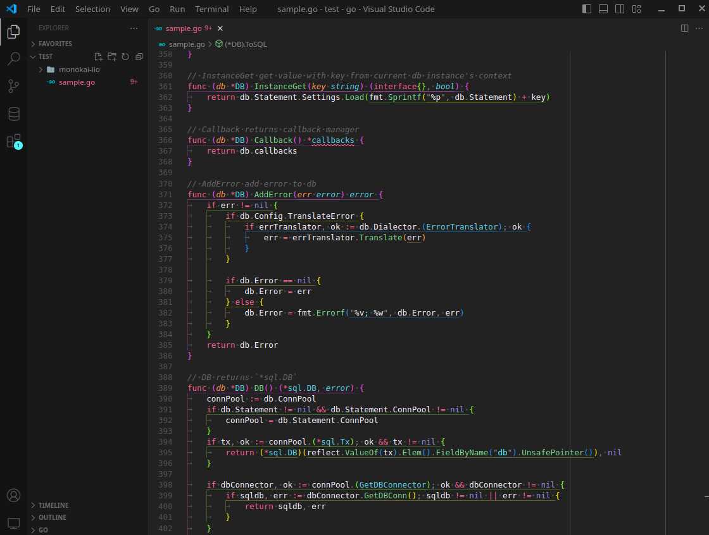
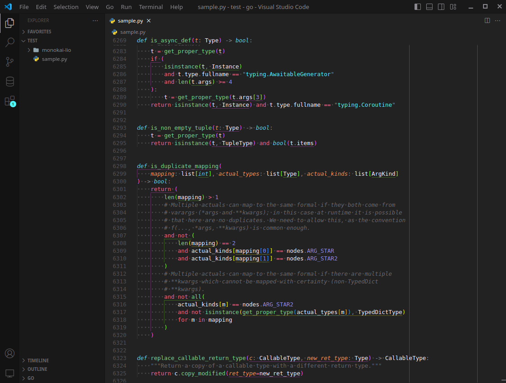

# Monokai Lio

A Vscode monokai theme

## Screenshots

### Go

### Python

## Installation

You can install this theme via the `.vsix` file.  
Download the `.vsix` from the releases, then, 
in Vscode go to `Extentions > three dots menu > Install from VSIX`.
